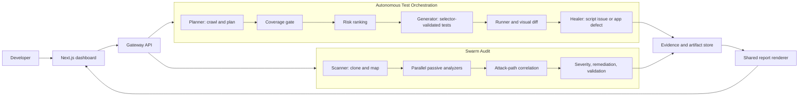

# Aivar Dual-Agent Quality Platform: Build Plan and GPT Prompt

## Product definition

Build **Aivar Assurance Platform** around one mandatory engine and one optional, additional engine:

| Engine | Priority | Input | Purpose | Primary output |
| --- | --- | --- | --- | --- |
| Autonomous Test Orchestration | Mandatory, primary focus | A web-app URL. Credentials only if the target is not public. Optional PRD and intent. | Discover, plan, generate, execute, heal, and report UI tests with zero human input during the run | Risk-ranked test report, generated Playwright suite, visual findings, packaged application defects |
| Swarm Audit | Optional, additional feature | Authorized Git repository URL or local repository | Analyze code, dependencies, secrets, APIs, and cross-layer risk | Evidence-backed security report, remediation patches, dependency and secret findings, attack-path analysis |

The UI-testing engine is the deliverable the project is judged on and must be built to completion first. The code-audit engine is a bonus and may be partially built, feature-flagged off, or left as a documented roadmap item if time runs out, never at the expense of the UI engine.

Non-interactive contract (hard requirement): once a run starts, the pipeline never blocks on human input. The human supplies exactly two things up front, the target URL, and login credentials only when the target requires them (a public URL needs no credentials). Every other decision (what to test, whether coverage is sufficient, when to re-plan, how to classify a failure, whether to auto-heal) is made by the agents. There is no confirmation dialog, no continue-y-n prompt, no mid-run form, on the CLI, the API, or the dashboard.

The engines are independent deployable services. They share identity, run metadata, evidence schemas, report rendering, risk normalization, and a dashboard. Do not merge UI testing into an active penetration-testing tool. Do not make the code auditor interact with third-party production systems. Both engines must require an authorization acknowledgement recorded up front, not an interactive prompt, before a run.

## Goals and boundaries

### Required outcomes

1. A developer can submit a URL, and credentials only if the target needs them, and receive an autonomous, risk-ordered UI quality report with no further input required. This is the mandatory deliverable.
2. Optional, additional: a developer can submit an authorized source repository and receive a static, dependency, secret, API, and correlation-based security report.
3. If both engines are built, the dashboard can show either run type and a unified portfolio view without pretending their evidence has the same provenance.
4. Every material decision is explainable with evidence, confidence, agent name, timestamp, and a reproducible artifact path.
5. Low-confidence decisions are queued for review, never silently applied, and being queued does not pause the run or ask the human anything; it is just a label in the live log and the report.

### Non-goals

- No unauthorized testing, exploitation, credential guessing, scanning of third-party hosts, or destructive actions.
- No production-scale hosting, CI/CD integrations, cross-browser matrix, or full production-application coverage in the MVP.
- No hand-authored test scenarios in the generated test suite. Test behavior originates from the crawl, plan, live selector validation, and deterministic compiler fallback.
- No automatic merging of generated security patches. Patches are suggestions with validation results.

## Architecture



### Recommended implementation shape

Keep the two existing repositories usable during the MVP. Add a thin shared contract package only after their individual contracts are stable.

```text
Aivar-Projects/
  Autonomous-Test-Orchestration-Agent/     # Python, LangGraph, Playwright, FastAPI, Streamlit or shared dashboard client
  Swarm-Audit/                             # Python FastAPI audit backend, Next.js dashboard
  aivar-contracts/                         # Versioned Pydantic/JSON schemas, optional in phase 4
  docs/
    architecture.md
    threat-model.md
    demo-script.md
```

For a greenfield rebuild, prefer a monorepo with `apps/test-engine`, `apps/audit-engine`, `apps/dashboard`, and `packages/contracts`. Do not rewrite functioning code merely to reach that structure.

## Shared data contract

Use versioned Pydantic models and JSON artifacts. Never pass raw LLM text between services.

```text
RunEnvelope
  run_id, product, status, started_at, completed_at
  target: AuthorizedTarget
  authorization: AuthorizationRecord
  policy_version, model_provider, model_versions
  decision_log: [DecisionEvent]
  findings: [Finding]
  artifacts: [Artifact]
  errors: [RecordedError]

Finding
  finding_id, engine, category, title, severity, business_risk
  confidence, status, rationale
  evidence: [EvidenceRef]
  remediation, human_review_required

EvidenceRef
  kind, path_or_url, content_hash, captured_at, redacted
```

Severity is security impact; business risk is product impact. Retain both. Normalize risk only for dashboard sorting; do not overwrite the original engine assessment.

## Detailed UI-testing engine plan

### Pipeline

1. Validate URL, same-origin crawl policy, authorization acknowledgement, and safe-run configuration. Store credentials only in an in-memory secret vault keyed by run ID.
2. Planner logs in only when approved credentials are present, crawls with Playwright using breadth-first traversal, captures a sanitized DOM inventory, routes, forms, visible actions, screenshots, and console errors.
3. Planner returns a strict JSON plan containing happy paths, edge cases, error states, expected outcomes, data-sensitivity tags, and references to observed page evidence.
4. Coverage gate applies deterministic rules plus an LLM review. Required applicable coverage: primary journeys, one edge case, one error state, login success and invalid credentials when login exists, checkout/cart when discovered, and an assertion for every flow. Replan at most twice; then force-proceed with a visible limitation.
5. Risk rank flows before generation. High: auth, payment, checkout, PII, destructive actions. Medium: search, profile update, business forms. Low: static content and cosmetic navigation. Unknown defaults to medium.
6. Generator proposes Playwright Python tests from the approved plan. It must validate each locator live and require exactly one visible match. AST-audit model code; if it fails validation twice, use a deterministic renderer built from planner steps and validated selectors. Mark that provenance.
7. Runner executes in isolated browser contexts, records tracebacks, sanitized DOM snapshots, console messages, screenshots, and result metadata. Parallelize only independent, non-mutating flows behind a feature flag.
8. Healer receives evidence and classifies `SCRIPT_ISSUE`, `APPLICATION_DEFECT`, or `INSUFFICIENT_EVIDENCE`. It may alter locators, waits, or navigation only. It must mechanically reject assertion deletion, assertion weakening, and broad exception swallowing. Auto-apply only at confidence >= 0.60 and rerun once.
9. Visual diff compares normalized screenshots with per-route baselines. First successful screenshot becomes baseline. Report above-threshold diffs separately from functional failures.
10. Package confirmed application defects into a minimal safe repro test, masked screenshot, and ticket-ready Markdown. Render JSON, Markdown, and HTML reports ordered by risk.

### UI-engine acceptance tests

- A URL alone starts an offline-stub smoke run; a real run requires configured provider credentials.
- A deliberately incomplete plan re-enters Planner with specific coverage feedback.
- A nonexistent selector is never emitted as an executable locator.
- A failing test with a stale locator can be healed only with reproducible evidence.
- A failure caused by wrong app behavior is reported as a defect rather than weakened into a passing test.
- Credential values do not occur in logs, events, reports, screenshots, generated code, or API responses.

## Detailed code-audit engine plan

### Pipeline

1. Validate repository URL/path, authorization acknowledgement, cloning policy, and resource quotas. Shallow-clone into an isolated temporary directory; never execute target code by default.
2. Scanner builds an inventory: language/framework detection, manifests, lockfiles, route definitions, authentication middleware, infrastructure configuration, test assets, and generated/vendor exclusions.
3. Run passive analyzers in parallel: Semgrep with pinned rules, dependency/SBOM parsing with OSV queries, secret-pattern detection with entropy/context false-positive reduction, and framework-aware API/authentication analysis.
4. Convert scanner output into normalized findings with exact file/line references, rule IDs, tool versions, and evidence snippets redacted when sensitive.
5. Attack-path correlator may reason only over verified findings. It must label chains as `confirmed`, `plausible`, or `hypothesis`; never invent an exploit prerequisite or claim exploitation occurred.
6. Severity agent calculates CVSS v3.1 using a documented vector and retains the vector. Risk agent estimates business impact from configurable assumptions and labels estimates as estimates.
7. Patch agent creates minimal unified diffs using actual nearby source context. Validation agent applies each patch in an isolated copy and runs the narrowest existing lint, test, or typecheck. Report unvalidated fixes as suggestions.
8. PoC output is safe verification only: non-destructive, local/repository-scoped, no credential attacks, no persistence, no exfiltration, and no commands against a remote target. Prefer a regression test or static verification command.
9. Render a report containing executive summary, evidence, severity, affected components, confidence, attack-path relationships, remediation priority, suggested patches, and validation status.

### Audit-engine acceptance tests

- A known vulnerable fixture repository produces a dependency finding with OSV evidence.
- A fake secret fixture is detected but a documented placeholder is downgraded with rationale.
- Correlation only references finding IDs that exist in the run.
- A patch suggestion includes a diff and reports whether its isolated validation passed.
- The analyzer does not run project install scripts, application servers, or arbitrary repository code during a default audit.
- Reports redact tokens and secret values while preserving useful location evidence.

## Security, governance, and reliability

- Require `authorized_use: true` plus a recorded declaration that the user owns or is authorized to assess the target.
- Enforce SSRF protection for UI runs: reject private, loopback, link-local, metadata, and disallowed redirects unless a local-development flag is explicitly enabled.
- Enforce repository allowlisting/ownership confirmation in production deployments.
- Redact secrets at ingestion, logging, event streaming, report rendering, and artifact writing. Use a central redaction utility and test it.
- Treat LLM output as untrusted data. Validate schemas, cap prompt sizes, sanitize browser/DOM content against prompt injection, and preserve source attribution.
- Use retry with exponential backoff and jitter for transient model/provider errors. Do not retry authentication failures.
- Make every agent node idempotent or record a checkpoint so a partial run can resume or produce a partial report.
- Apply quotas: crawl depth/pages, browser timeout, repository size/files, scan time, artifact size, LLM tokens, and concurrent runs.

## Delivery sequence

1. **Foundation:** configuration, secrets/redaction, structured logging, Pydantic schemas, artifact storage, authorization records, test fixtures, and health endpoints.
2. **UI MVP:** graph skeleton, offline stub, crawl inventory, plan schema, deterministic coverage gate, selector validation, runner, report, and unit tests.
3. **UI differentiation:** risk ranking, healer evidence and confidence branch, visual baseline/diff, bug packaging, live decision feed.
4. **Audit MVP:** isolated cloning, inventory, Semgrep, OSV dependency scanning, secrets scanning, API analysis, normalized report, and fixture tests.
5. **Audit differentiation:** attack-path correlation safeguards, CVSS vectors, patch suggestions, isolated patch validation, safe verification artifacts.
6. **Unified experience:** dashboard views, shared run list, normalized cross-engine portfolio report, WebSocket/SSE progress, access controls.
7. **Demo hardening:** fixed demo fixtures, offline smoke mode, runbooks, architecture diagram, 2-5 minute demo script, and explicit limitations.

## Definition of done

The MVP is complete when both engines run independently against approved fixtures, record a complete decision/event trail, create evidence-backed reports, enforce their safety boundaries, pass their deterministic tests, and present results in the dashboard without leaking secrets or overstating confidence.

---

# Copy-Ready GPT Build Prompt

```text
You are a senior software architect, AI-agent engineer, application-security engineer, prompt engineer, and test engineer. Build a complete, runnable, security-conscious product named "Aivar Assurance Platform." Work in the existing workspace where two partially implemented projects already exist:

- Autonomous-Test-Orchestration-Agent: UI-level autonomous test orchestration.
- Swarm Audit: code-level repository security audit.

Do not replace working architecture blindly. Inspect the current files first, preserve useful existing behavior and APIs where reasonable, and implement missing features incrementally. Treat this specification as the product contract. Produce real code, migrations/configuration, tests, documentation, and a runnable local experience, not pseudocode or a mock-only dashboard.

PRODUCT BOUNDARY
Build two independently runnable engines with a shared evidence and reporting contract:

1. UI Test Orchestration Engine
Input: authorized web-application URL, optional test credentials, optional PRD text, optional natural-language test intent.
Output: agent-generated Playwright test suite, risk-ranked test results, healed-script actions, visual-regression findings, packaged application defects, and JSON/Markdown/HTML reports.

2. Code Audit Engine
Input: authorized Git repository URL or local repository path.
Output: static-analysis, dependency, secret, and API/auth findings; cautious cross-layer attack-path analysis; CVSS evidence; suggested patches; isolated patch-validation results; and a security report.

Both inputs require an explicit authorization acknowledgement recorded with the run. The engines share run IDs, audit logs, artifact metadata, normalized findings, redaction, and dashboard presentation. They must not be combined into an active penetration-testing system. Never conduct unauthorized scanning or exploitation. Do not run arbitrary target repository code, install scripts, or application servers during the default code audit.

TECHNICAL BASELINE
- Python 3.11 or 3.12 for backend services.
- FastAPI with Pydantic v2 for APIs and schemas.
- LangGraph with explicit nodes and conditional edges for UI orchestration; no monolithic prompt chain.
- Playwright async Python API for crawling, selector validation, UI test execution, traces, and screenshots.
- Semgrep OSS, OSV API, package-manifest parsers, and safe regex/entropy heuristics for code auditing.
- Groq OpenAI-compatible API as the primary LLM provider; read keys only from environment variables. Separate reasoning and code-generation model roles. Implement provider abstraction, JSON schema validation, invalid-JSON repair retry, 429/5xx exponential backoff with jitter, and no retry for 401/403.
- Preserve the existing Next.js frontend where present; otherwise use a minimal production-quality Next.js dashboard. Streamlit may remain as an optional UI-engine development view, but the shared user experience should be in Next.js.
- Use Docker Compose for local integration where it already exists. Pin dependencies and provide .env.example files. Never hardcode secrets.

SHARED CONTRACTS
Create versioned Pydantic schemas for RunEnvelope, AuthorizedTarget, AuthorizationRecord, DecisionEvent, Finding, EvidenceRef, Artifact, and RecordedError. Every finding must include: finding_id, engine, category, title, severity, business_risk, confidence in [0,1], status, rationale, evidence references, remediation, and human_review_required. Retain security severity separately from business risk. Use only validated structured objects between agents, APIs, reports, and UI.

UI ENGINE REQUIREMENTS
1. The URL is the sole required functional input, while authorization acknowledgement is required as a safety control. Store supplied test credentials only in an in-memory secret vault keyed by run ID. Never place values in graph state, logs, events, generated tests, reports, screenshots, or API responses.
2. Planner: use a same-origin, depth/page-capped Playwright BFS crawl. Create a structured JSON test plan based on observed routes, forms, actions, and DOM evidence. Include happy paths, edge cases, error states, concrete expected outcomes, and evidence references. Support optional PRD/intent as scope input without dropping mandatory coverage.
3. Coverage gate: evaluate the plan before generation using deterministic rules plus an LLM rubric. Require applicable primary journeys, edge case, error state, login success and invalid-login state if login exists, cart/checkout coverage if discovered, and expected result per flow. On gaps, return specific replan feedback. Cap replan loop at 2, then force-proceed with an explicit limitation in the report.
4. Risk ranking: high for authentication, payment, checkout, PII, and destructive actions; medium for search, profiles, and business forms; low for static/cosmetic content; unknown defaults to medium. Carry the rank into generation order, execution order, and final report sorting.
5. Generator: create Python Playwright tests only from the approved plan. Prove locators live; retain locators resolving to exactly one visible element. AST-audit LLM-created code using import allowlists, forbidden names, dunder restrictions, and a required test signature. Retry correction once; then use a deterministic renderer based solely on agent-plan steps and validated selectors. Mark the source/provenance.
6. Runner: use isolated browser contexts; capture sanitized DOM snapshot, traceback, console messages, trace, and masked screenshot. Parallelize independent, non-mutating flows only behind a disabled-by-default feature flag.
7. Healer: classify failures as SCRIPT_ISSUE, APPLICATION_DEFECT, or INSUFFICIENT_EVIDENCE using collected evidence and a structured JSON prompt. Calculate an evidence-weighted confidence. Below 0.60, do not apply a patch and queue for human review. At >=0.60, it may repair only locator, wait, or navigation mechanics, then rerun once. Mechanically reject removing assertions, downgrading assertions, commenting assertions, broad exception swallowing, or hiding failures.
8. Visual regression: store a baseline on first successful run, compare later masked screenshots using Pillow/pixel difference, configurable threshold, and separate visual findings from functional failures.
9. Bug packaging: for confirmed application defects, emit one folder per finding with safe minimal repro test, masked failure screenshot, ticket-ready Markdown title/description, risk/confidence/evidence, and artifact hashes.
10. Deliver reports as JSON, Markdown, and self-contained HTML, ordered by business risk and outcome severity. Include explicit limitations, model/provider, and generated-vs-deterministic test provenance.

CODE AUDIT ENGINE REQUIREMENTS
1. Validate authorized repository source. Shallow clone into a temporary isolated directory with size, file-count, timeout, and symlink protections. Do not execute repository code in default mode.
2. Scanner inventory must detect language/framework, manifests and lockfiles, routes, auth middleware, configuration, IaC, and generated/vendor directories.
3. Run these passive analyzers in parallel: Semgrep with pinned relevant rules, dependency/SBOM parser with OSV evidence, secrets detector with context/placeholder false-positive reduction, and framework-aware API/auth gap detector.
4. Normalize all tool results with exact file and line evidence, rule/tool IDs, versions, and redacted snippets.
5. Attack-path correlation may use only normalized verified findings. It must emit relationships by finding ID and classify each chain as confirmed, plausible, or hypothesis. Never invent prerequisites, claim remote exploitation, or present a hypothesis as a verified exploit.
6. Compute CVSS v3.1 with a documented vector and show both vector and score. Keep business-impact calculations configurable and clearly labeled as estimates.
7. Generate minimal patch diffs from actual source context. In an isolated repository copy, apply each patch and run the narrowest available relevant lint/test/typecheck. Report validation output and do not auto-merge patches.
8. Any verification artifact must be safe, non-destructive, local/repository-scoped, non-persistent, and non-exfiltrating. Prefer a regression test or static verification command rather than an exploit script.
9. Generate executive and technical reports with priorities, evidence, relationships, remediation order, patches, validation status, confidence, and limitations.

SECURITY AND RELIABILITY REQUIREMENTS
- Implement central recursive redaction for registered secret values, sensitive field names, common token formats, URLs with userinfo, logs, streamed events, report rendering, and stored artifacts. Write redaction tests.
- Protect UI crawling from SSRF: block private, loopback, link-local, cloud-metadata, and disallowed redirect targets by default; permit local targets only through an explicit development flag.
- Treat web page text, repository text, and LLM output as untrusted. Guard prompt injection by separating untrusted evidence from instructions, limiting lengths, retaining source references, and validating every structured output.
- Use resource quotas and cancellation: crawl pages/depth, browser timeouts, repository size/files, scan time, token budget, artifacts, and concurrency.
- Each long-running node must create decision events with start, decision, completion, confidence/rationale when applicable, errors, and artifact links. Persist enough checkpoints to return a partial report rather than lose the run.

API AND DASHBOARD
- Expose FastAPI endpoints to start UI runs and audit runs, retrieve status/events, reports, and individual artifacts/findings. Never return credentials.
- Provide SSE or WebSocket progress for a live dashboard.
- The Next.js dashboard must support separate UI-Test and Code-Audit start forms, an authorization checkbox/declaration, live decision stream, run history, risk-ordered findings, visual findings, package/download actions, patch validation status, and clear "needs human review" states.
- Keep user-facing language precise: distinguish test-script failures, application defects, visual regressions, static findings, plausible attack paths, and confirmed evidence.

TESTING AND ACCEPTANCE
Create deterministic unit tests for JSON parsing, redaction, SSRF URL policy, coverage rubric, selector validation, confidence-threshold branch, assertion-weakening rejection, visual-diff threshold, risk ordering, OSV result normalization, attack-chain referential integrity, patch validation reporting, and report rendering. Add integration fixtures: a harmless local demo web app plus small fixture repositories containing known safe test cases. Do not rely on live third-party targets for CI.

IMPLEMENTATION ORDER
1. Inspect current repositories and write an architecture/compatibility note.
2. Implement/fix shared schemas, config, redaction, structured logging, authorization, artifacts, tests.
3. Complete UI engine core graph and test it against local fixture plus offline LLM stub.
4. Add UI differentiation: risk, healer guard, visual diff, bug package, report.
5. Complete audit scanner and passive analyzer pipeline with fixture tests.
6. Add cautious correlation, patches, isolated validation, and reporting.
7. Integrate API/dashboard progress and cross-engine run list.
8. Run focused tests after each module and then full relevant test suites. Fix root causes, not surface symptoms.
9. Write README files, Mermaid architecture diagram, setup instructions, .env.example, threat model, known limitations, and a 2-5 minute demo script.

WORKING STYLE
Before editing, inspect the local implementation and state a short falsifiable hypothesis about the controlling code path. Make small edits, run focused validation immediately, and report actual command results. Do not silently stub required features. Where a capability remains incomplete, implement a safe degraded behavior, feature-flag it, and document it honestly. Do not create manual test scripts that masquerade as agent-generated tests. Do not use secrets from existing files or output any secret values.

Begin now by inspecting the two existing projects, identifying the highest-value missing capabilities against this specification, and implementing the foundation with tests. Then continue module by module until the system is runnable locally.
```